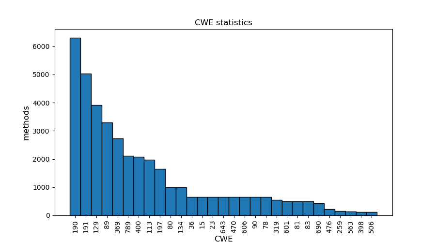

## [Link to dataset](https://drive.google.com/file/d/1tp4k7XCr6BKzKiZdOsJ7wJ9pg9YW4FDu/view?usp=sharing) of ~ 128k CAGs.

Dataset was collected using [CAG_builder_v2_4](./dataset/CAG_builder_v2_4.ipynb).
Only 128k/208k methods were included, while the others were dropped due to low word count, low XML depth or method name that does not start with "good" or "bad".

Dataset is a list of `torch_geometric.data.Data` objects saved with `pickle`.

Each `Data` object holds the following attributes:
- `data.x` : Node feature matrix with shape [num_nodes, num_node_features]
- `edge_index` : torch.tensor([2, num_edges], dtype=torch.long)
- `y` : int, target variable, 1 if code has a vulnerability issue, 0 if not
- `num_nodes` : int, number of nodes in graph
- `cwe` : int, number of CWE if y=1, otherwise 0 
'

The function `create_embedding` that calculates embeddings can be seen in [embedding.py](./dataset/embedding.py)

## Some CWE statistics
- Total number of methods: 128039
- Total number of different CWEs: 105
- Number of methods with CWE: 41069 or 32.08%

Top 20:
- CWE 190 : Integer_Overflow
- CWE 191 : Integer_Underflow
- CWE 129 : Improper_Validation_of_Array_Index
- CWE 89 : SQL_Injection
- CWE 369 : Divide_by_Zero
- CWE 789 : Uncontrolled_Mem_Alloc
- CWE 400 : Resource_Exhaustion
- CWE 113 : HTTP_Response_Splitting
- CWE 197 : Numeric_Truncation_Error
- CWE 80 : XSS
- CWE 134 : Uncontrolled_Format_String
- CWE 36 : Absolute_Path_Traversal
- CWE 15 : External_Control_of_System_or_Configuration_Setting
- CWE 23 : Relative_Path_Traversal
- CWE 643 : Xpath_Injection
- CWE 470 : Unsafe_Reflection
- CWE 606 : Unchecked_Loop_Condition
- CWE 90 : LDAP_Injection
- CWE 78 : OS_Command_Injection
- CWE 319 : Cleartext_Tx_Sensitive_Info